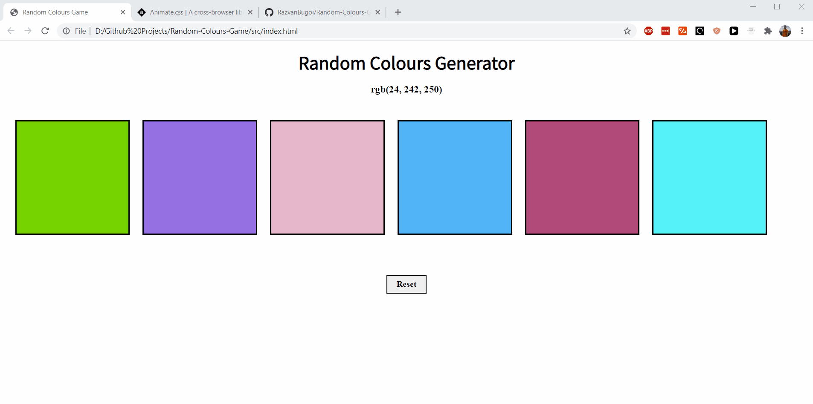

# Random-Colours-Game

This project is about learning how to combine HTML, CSS and JavaScript to make a small application. 

Every time you load the game, a random RGB colour code is generated in the heading. Your goal is to guess which box has that background colour. 
If you choose the right box, you will get a positive head shake like annimation and a congratulations message below. If you are wrong, you'll get a negative head shake like annimation and a lost message below.

Click **[here](https://razvanbugoi.github.io/Random-Colours-Game/src/index.html)** to play.

;